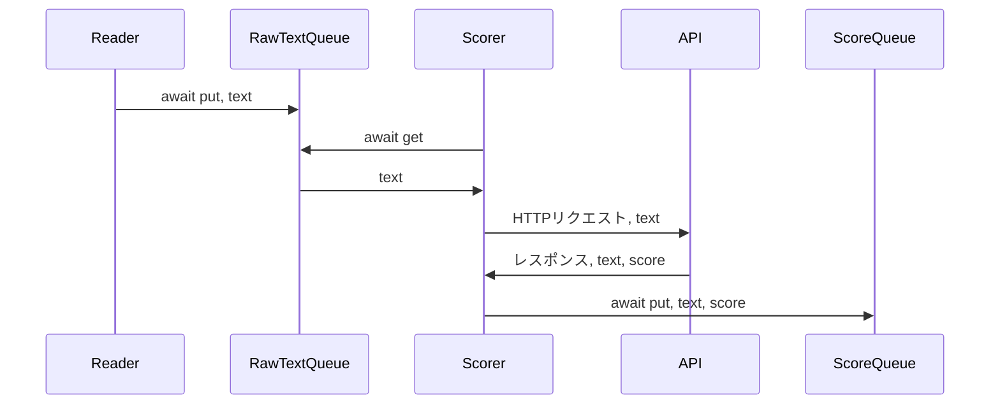
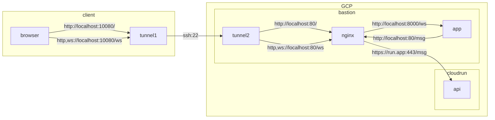
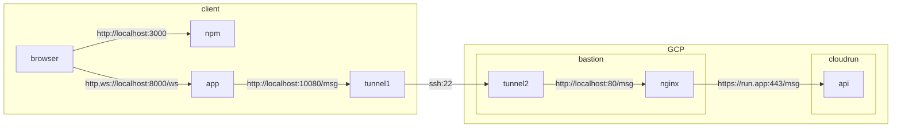

# ストリームのリファクタ

- データソースから読む
- テキストをAPIに投げる
- 結果をyieldする

のを、別のworkerにして非同期で処理したい

todo: RawTextQueueとScoreQueueで、終わったことは、どうやって検知するか考える

## 本番と開発用のポートなどの差異

※ ここの流れは、だいぶ変えたあとに編集してない。
同じ図が必要になった場合は、実装を確認して変更する必要がある。

本番

開発

# todo

## fastapiとreactでwebsockets通信

- [x] fastapiでシンプルにindex.htmlを返す
- [x] fastapiでwebsocketsのechoサーバーを実装
- [x] reactでechoクライアントを実装

## スコアAPIに通信を開ける

- [x] nginx入れる
- [x] nginx起動
- [x] :80/msgをAPIに転送

## サーバーからの受信を一時停止したい

- [x] クライアント→サーバーにstop/startメッセージを送れるようにする
- [x] サーバー側にメッセージを受け取るループを置く必要がある
- [x] メッセージを受け取るループとは別にメッセージを送り続けるループが必要
- [x] メッセージを受け取るループとメッセージを送るループの間でstop/startのシグナルを授受する必要がある
