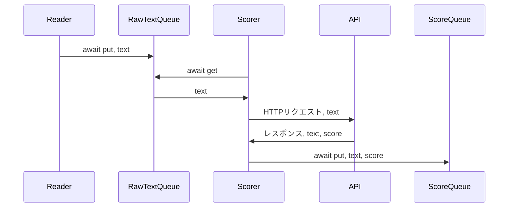
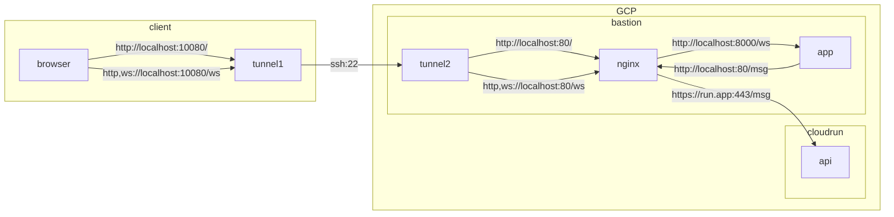
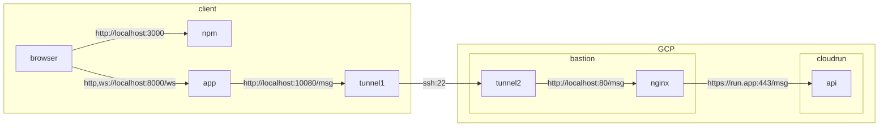

# streaming

## スコアの調整方法

APIが返す値は基準化されておらず、使いづらい。そこで、平均0, 分散1になるように正規化する。

もとのスコアを $s$ 、スコアの平均と分散を$\mu, \sigma^2$とする。調整済みのスコア$s'$は、以下で計算できる。

$$
s' = \frac{s - \mu}{\sigma}
$$

ここで、スコアの平均と分散は未知なので、オンラインで推定する。今、ツイートを順番に取得しスコアを計算している状況を考える。$n$個目のツイートのスコアを$s[n]$とし、$n$番目までのツイートを見た時点での平均と分散の推定値を$\mu[n], \sigma^2[n]$とする。新しいツイートと、そのスコアを得たら、以下の式によって平均と分散の推定値を更新する。

$$
\mu[n+1] = \frac{n*\mu[n]+s[n+1]}{1+n}
$$

$$
\sigma^2[n+1] = \frac{n*(\sigma^2[n]+\mu[n]^2) + s[n+1]^2}{1+n} - \mu[n+1]^2
$$

### ソースコード

- 平均・分散の推定値の更新は、[useNormalize.tsx](./fe/src/hooks/useNormalize.tsx)で行っている
- スコアの調整の計算は、[App.tsx](./fe/src/App.tsx)の`calcNormalize`関数で行っている

## ストリームのリファクタ

- データソースから読む
- テキストをAPIに投げる
- 結果をyieldする

のを、別のworkerにして非同期で処理したい→済

todo: RawTextQueueとScoreQueueで、終わったことは、どうやって検知するか考える

## 本番と開発用のポートなどの差異

※ ここの流れは、だいぶ変えたあとに編集してない。
同じ図が必要になった場合は、実装を確認して変更する必要がある。

本番

開発

# todo

## fastapiとreactでwebsockets通信

- [x] fastapiでシンプルにindex.htmlを返す
- [x] fastapiでwebsocketsのechoサーバーを実装
- [x] reactでechoクライアントを実装

## スコアAPIに通信を開ける

- [x] nginx入れる
- [x] nginx起動
- [x] :80/msgをAPIに転送

## サーバーからの受信を一時停止したい

- [x] クライアント→サーバーにstop/startメッセージを送れるようにする
- [x] サーバー側にメッセージを受け取るループを置く必要がある
- [x] メッセージを受け取るループとは別にメッセージを送り続けるループが必要
- [x] メッセージを受け取るループとメッセージを送るループの間でstop/startのシグナルを授受する必要がある
